<!-- PROJECT LOGO -->
<br />
<p align="center">
  <a href="https://github.com/citi-onboarding/TechCenter">
    
  </a>

  <h3 align="center">Tech Center</h3>

  <p align="center">
This contains all the source code for the site made for the Tech Center community. TechCenter is a community created in order to encourage the creation of connections, sharing learning, within a healthy exchange environment between people passionate about technology and companies in the market!
    <br />
    <a href="https://github.com/citi-onboarding/TechCenter"><strong>Explore the docs »</strong></a>
    <br />
    <br />
    ·
    <a href="https://github.com/citi-onboarding/TechCenter/issues">Report Bug</a>
    ·
    <a href="https://github.com/citi-onboarding/TechCenter/issues">Request Feature</a>
  </p>
</p>


<!-- TABLE OF CONTENTS -->
<details open="open">
  <summary><h2 style="display: inline-block">Table of Contents</h2></summary>
  <ol>
    <li><a href="#contributors">Contributors</a></li>
    <li>
      <a href="#about-the-project">About The Project</a>
      <ul>
        <li><a href="#built-with">Built With</a></li>
      </ul>
    </li>
        <li><a href="#mockup">Mockup</a></li>
        <li><a href="#mockup-mobile">Mockup Mobile</a></li>
        <li><a href="#how-to-run">How To Run</a></li>
        <li><a href="#another-way-to-run">Another Way To Run</a></li>
    <li><a href="#contact">Contact</a></li>
  </ol>
</details>

## Contributors


<table>
  <tr>
<td align="center"><a href="https://github.com/apfdamascena"><br /><sub><b>Alex Damascena</b></sub></a><br/></td>

<td align="center"><a href="https://github.com/joaovictorbelo"><br /><sub><b>João Belo</b></sub></a><br/></td>


<td align="center"><a href="https://github.com/phsb5321"><br /><sub><b>Alex Damascena</b></sub></a><br/></td>
</tr>


 </table>


## About The Project

This contains all the source code for the site made for the Tech Center community. TechCenter is a community created in order to encourage the creation of connections, sharing learning, within a healthy exchange environment between people passionate about technology and companies in the market!

This site was part of the PTA challenge - the last phase to join the junior company Citi and which has a more technical content - and had as developers: @apfdamascena and @phsb5321. During this challenge, @joaovictorbelo was the squad's software manager, as he was also participating in a selection process to become the citi's software manager

Alana Ramos was also part of the 7belo squad and had the role of building the mockup and monitoring the entire development of the site.


### Built With

* [ React ]( https://pt-br.reactjs.org/ )
* [ Keystone ]( https://v4.keystonejs.com/ )
* [ Docker ]( https://www.docker.com/ )

## Mockup

The mockup was built by Alana Ramos but it's worth remembering that she was constantly asking for feedback on what she was doing.

| | | |
|:-------------------------:|:-------------------------:|:-------------------------:|
|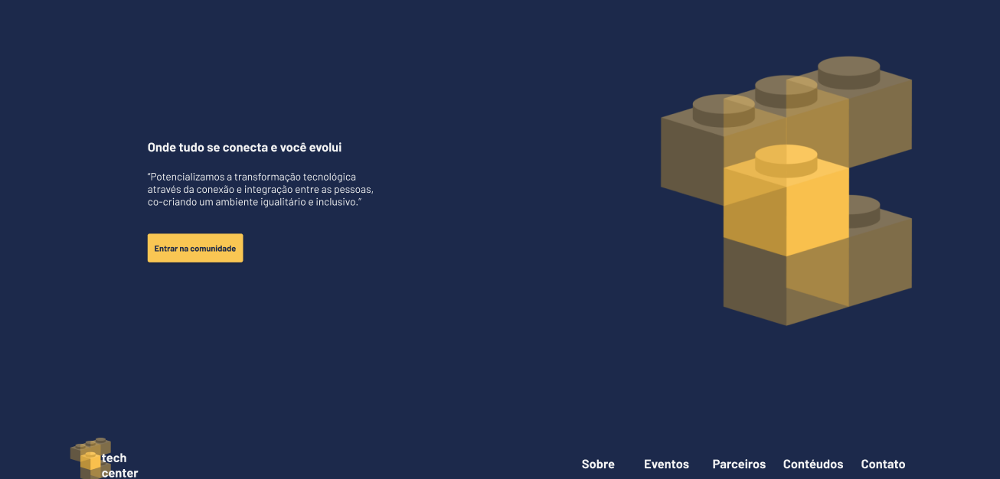  Initial Section |  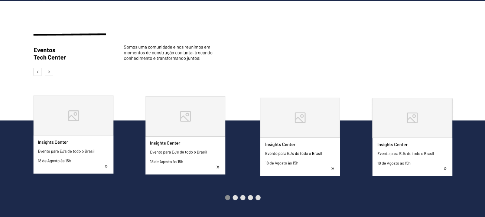 Event Section |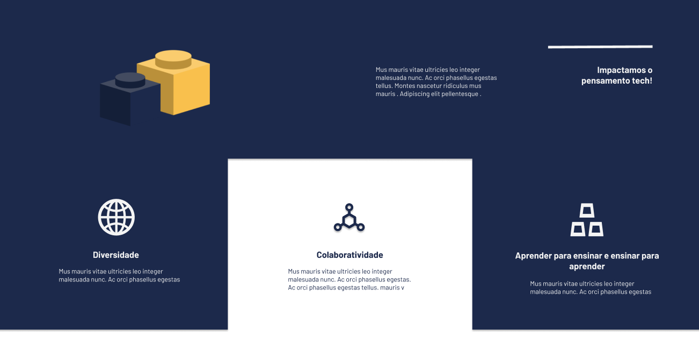 About Us Section
|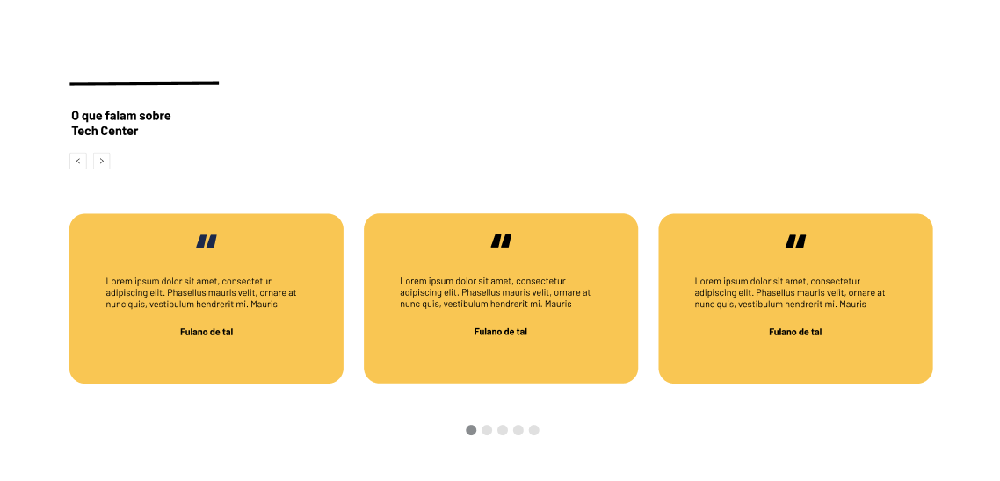  Feedback Section |   Partnership Section |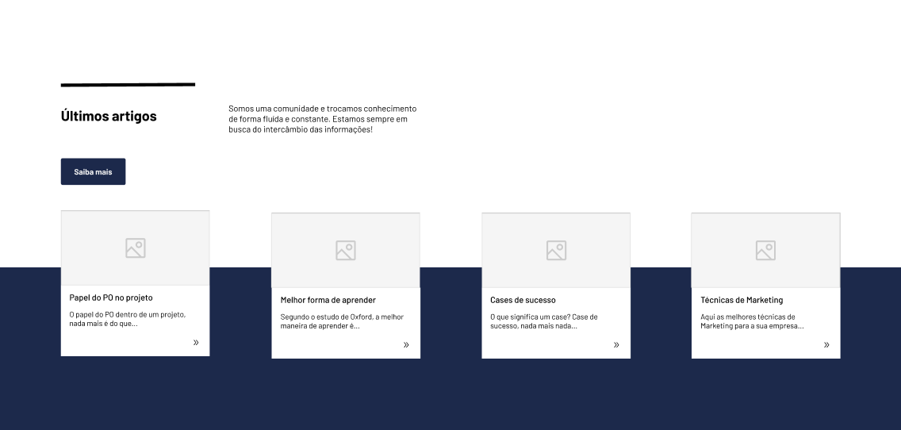 Article Section | Article Section

| | | |
|:-------------------------:|:-------------------------:|:-------------------------:|
|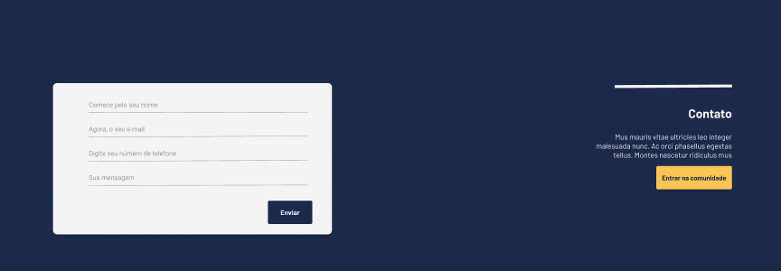  Contact Section |  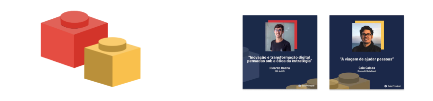 Contact Section + |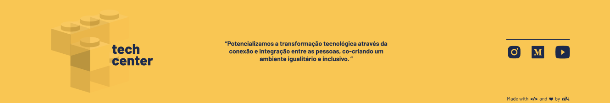 Footer Section

## Mockup Mobile

| | | |
|:-------------------------:|:-------------------------:|:-------------------------:|
|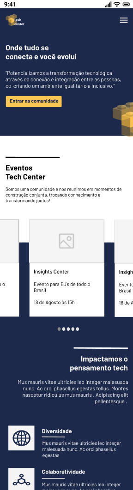  Mobile |  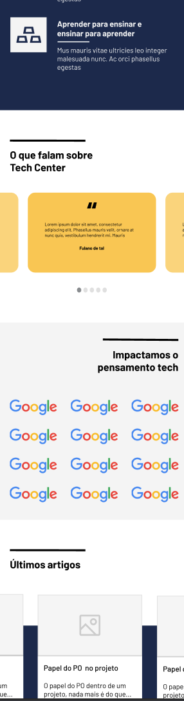 Mobile |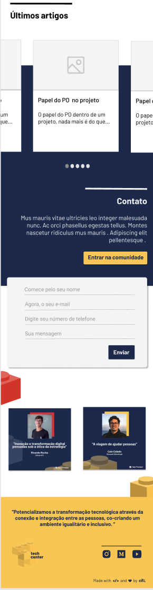 Mobile
|

## How To Run 

```sh
  git clone https://github.com/citi-onboarding/TechCenter.git
```

At TechCenter folder
```sh
  cd ./server/ && yarn install && ../client/ && yarn install && cd ..
``` 

At client folder
```sh
  yarn start
```

At server folder
```sh
  yarn run dev
```

## Another Way To Run

```sh
  git clone https://github.com/citi-onboarding/TechCenter.git
```

At TechCenter folder 
```sh
  docker-compose build && docker-compose up
```

## Contact
- Alana Ramos - alana.ramos@citi.org.br
- Alex Damsacena - alex.damascena@citi.org.br
- João Belo - joao.belo@citi.org.br
- Pedro Balbino - pedro.balbino@citi.org.br


<!-- MARKDOWN LINKS & IMAGES -->
<!-- https://www.markdownguide.org/basic-syntax/#reference-style-links -->
[contributors-shield]: https://img.shields.io/github/contributors/github_username/repo.svg?style=for-the-badge
[contributors-url]: https://github.com/github_username/repo/graphs/contributors
[forks-shield]: https://img.shields.io/github/forks/github_username/repo.svg?style=for-the-badge
[forks-url]: https://github.com/github_username/repo/network/members
[stars-shield]: https://img.shields.io/github/stars/github_username/repo.svg?style=for-the-badge
[stars-url]: https://github.com/github_username/repo/stargazers
[issues-shield]: https://img.shields.io/github/issues/github_username/repo.svg?style=for-the-badge
[issues-url]: https://github.com/github_username/repo/issues
[license-shield]: https://img.shields.io/github/license/github_username/repo.svg?style=for-the-badge
[license-url]: https://github.com/github_username/repo/blob/master/LICENSE.txt
[linkedin-shield]: https://img.shields.io/badge/-LinkedIn-black.svg?style=for-the-badge&logo=linkedin&colorB=555
[linkedin-url]: https://linkedin.com/in/github_username